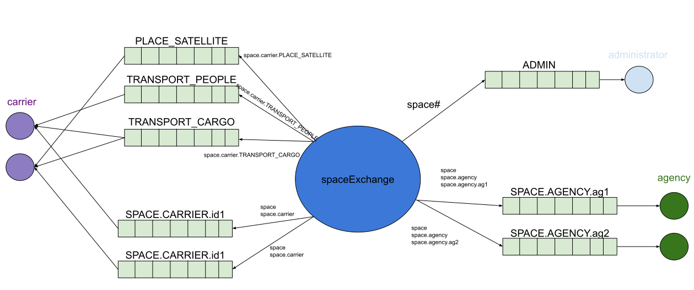

# space-program
University project simulating space agencies and carriers with RabbitMQ.
## Prerequisites
* Java 14
* Gradle

## Features
* Each agency can make one of 3 orders: `PLACE_SATELLITE`, `TRANSPORT_PEOPLE` or `TRANSPORT_CARGO`
* Each carrier can handle two types of those orders
* Each Admin receives all messages in the system and can also perform additional actoins:
  * send message to all agencies
  * send message to all carriers
  * send message to all
  
### Schema ilustrating topology with two agencies and two carriers:

  
